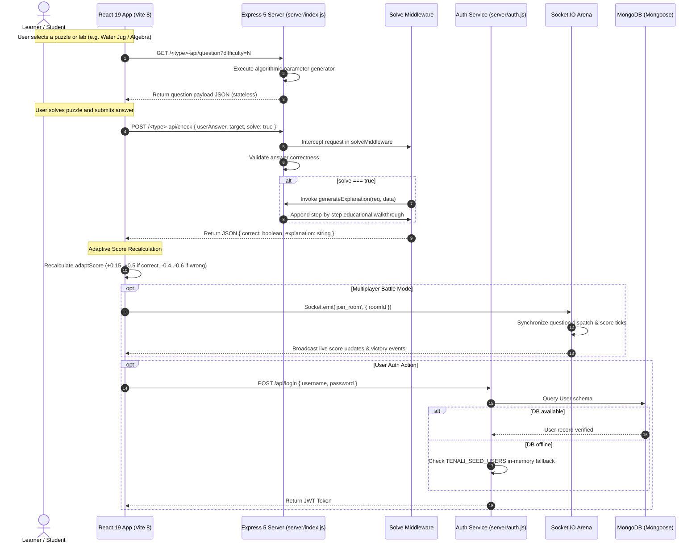

# Tenali — Onboarding Notes

**Contributor:** Krishna ([Krishna009-pro](https://github.com/Krishna009-pro))  
**Date:** September 1, 2026  
**Repo:** [vicharanashala/tenali](https://github.com/vicharanashala/tenali)  

---

## 0. Why I'm writing this down

I spent a good chunk of the last few days just reading through Tenali before I touched anything — cloning it, running it locally, clicking through every lab, then actually opening `server/index.js` and scrolling for what felt like forever. This doc is basically that process written up: what the project is trying to do, how it's actually built, what I think is fragile about it, what I'd fix, and then the part I actually shipped. I wanted to write it in a way that's useful to the next person who onboards onto this repo too, not just as a record for myself, so I've tried to keep it honest about what I'm sure of versus what I'm guessing at from reading the code rather than talking to the maintainers directly.

One thing I'll say up front: this is a genuinely ambitious project for what looks like a fairly small contributor base. 880+ non-bot commits and 69 puzzle types is a lot of surface area, and it shows in both good and bad ways — there's a ton of thoughtful pedagogical design in here, and also a ton of the kind of debt you'd expect from a project that grew fast without much time to stop and refactor.

---

## 1. What Tenali actually is

Tenali is an open-source STEM learning platform, named after Tenali Raman, the 16th-century court poet and scholar of the Vijayanagara Empire who was famous for outwitting entire royal courts through pure logic and lateral thinking rather than brute force or authority. It's a fitting name, because the whole premise of the project is that math education shouldn't be about memorizing steps — it should be about building an intuition for *why* something works, the same way Tenali Raman solved problems by understanding the structure of a situation rather than following a script.

The complaint the project is built around is one I actually agree with, having tutored a bit myself: most digital math tools are static question banks dressed up with a nicer UI. You do the twenty problems, and now you've either memorized the twenty answers or you've genuinely learned the concept — and there's no way for the platform to tell the difference. Once you've exhausted the bank, the "practice" becomes rote recall instead of anything useful. Difficulty is usually bucketed into three or four rigid tiers too, so kids either get bored waiting for a jump in difficulty that never quite comes, or they hit a wall the moment they cross into the next bucket. And a lot of the concepts that actually benefit from spatial or visual intuition — linear Diophantine equations, operator precedence, geometric rotations — get taught with static text and formulas, which is about the worst possible medium for building a physical mental model of how these things behave.

Tenali tries to solve all three of these problems at once: questions are generated algorithmically instead of pulled from a bank, so in theory you never run out; difficulty is tracked as a continuous score rather than a bucket, so the ramp is smoother; and at least two of the modules (Water Jug and Equation Crafting) are full interactive visual labs rather than text-and-input forms.

It's aimed at four different kinds of users, and I think it's worth being explicit about this because the UI design decisions only make sense once you know who they're for:

- **Early learners, roughly ages 5–8** — kids who are still building basic numeracy and spatial reasoning. The 22-step Water Jug "Intuition Journey" is squarely aimed at this group; it doesn't even mention gcd until step 19.
- **Middle and high schoolers, ages 9–16** — the bulk of the 69 puzzle types (algebra, number theory, geometry, trigonometry, probability) are pitched here.
- **Competitive or collaborative learners** — kids who want to turn practice into a game, via the real-time 1v1 battle arena over Socket.IO.
- **Educators and self-learners** — anyone who wants an automated, step-by-step walkthrough of *how* to solve a problem rather than just whether their answer was right. That's what the `solveMiddleware` and `generateExplanation` machinery is for.

---

## 2. How the system actually fits together

Architecturally, Tenali is a single-process monolith, deployed on one VPS at `tenali.fun`. There's no microservices split, no separate API gateway, no queue — just one Express process serving both the API and (presumably, based on the deployment doc) the static frontend build, with MongoDB as the only external dependency. React 19 on the client handles the UI and all the local game-state logic, Express 5 handles routing and question generation server-side, JWT handles stateless auth, and Socket.IO layers real-time multiplayer on top of the same process.

I want to be fair to this choice before I list it as a problem later: for a project at this stage, run by a small team, a monolith on a single VPS is a perfectly reasonable trade. It's cheap to host, there's no distributed-systems complexity to reason about, and deployment is presumably just "push to the VPS and restart the process." The issues I raise later aren't really about the monolith-vs-microservices choice — they're about things that would be problems in *any* architecture, like the single 14,500-line file or the missing test coverage.

Here's roughly how a request flows through the system when a student works through a puzzle — they load a question, submit an answer, and optionally ask for a full walkthrough:



A few things about the users and moving parts that took me a bit of digging to fully understand:

- **Guests** get full access to all 69 puzzle types and both labs, no account needed. Their adaptive difficulty score lives entirely in component memory on the client, which means it resets the second they close the tab — a reasonable trade-off for frictionless access, though it does mean guest progress is genuinely disposable in a way I don't think is communicated to the user anywhere in the UI.
- **Logged-in students** authenticate through `/api/login` and get a JWT back. The session persists across page reloads via `localStorage`, and there's a custom `tenali-auth-change` window event that other components listen to when the auth state changes — a reasonably clean pattern for keeping the UI in sync without a heavier state management library.
- **Battle players** connect over Socket.IO for real-time 1v1 matches, with questions and score updates broadcast to both participants simultaneously.

Underneath the user-facing layer, there are really four distinct engines doing the actual work, and I think it's useful to name them separately even though they all live in the same file right now:

1. **The stateless question synthesizer** — pure functions in `server/index.js` that take a difficulty number and spit out randomized problem parameters. No state, no database hit, just math.
2. **The adaptive difficulty engine** — tracks a floating-point score from 0.0 to 3.0 per user session, mapped onto four tiers (easy, medium, hard, extrahard). Correct answers nudge it up by 0.15–0.5, wrong answers knock it down by 0.4–0.6 — so the penalty for a wrong answer is roughly double the reward for a right one, which I assume is intentional (biasing toward not frustrating a struggling student by ramping too fast) but is worth confirming with whoever designed the curve.
3. **The solve-and-explanation middleware** — the `res.json` monkey-patch I'll get into more below, which injects a Markdown-formatted walkthrough into the response when the client explicitly asks for one.
4. **The Socket.IO battle arena** — room creation, matchmaking, question dispatch, and live score ticking for the competitive mode.

---

## 3. Where the repo actually stands

This is a genuinely active codebase — 880+ non-bot commits, 69 distinct puzzle types, 2 full interactive labs, and two sizeable static datasets sitting alongside the code. Here's the stack, as best I could reconstruct it from `package.json` and imports:

| Layer | Tech | Version | What it's doing |
|---|---|---|---|
| Frontend framework | React | 19.0.0 | UI tree, state, rendering |
| Build tooling | Vite | 8.0.0 | Dev server, HMR, production bundling |
| Animation | Framer Motion | latest | Micro-animations, card transitions |
| 3D rendering | Three.js | latest | Spatial geometry / projection labs |
| Math canvas | Mafs | latest | Coordinate planes, vector plots, trig curves |
| Computer vision | face-api.js | latest | Webcam-based engagement detection challenges |
| Backend runtime | Node.js | 20+ | App server |
| Web framework | Express | 5.0.0 | Routing, static serving, middleware |
| Realtime | Socket.IO | 4.0.0 | Battle arena websockets |
| DB / ODM | Mongoose / MongoDB | 9.0.0 | User accounts, credentials |
| Auth | jsonwebtoken | latest | Stateless token auth |

And the repo layout, which took a bit of `find` and `wc -l` to actually map out properly:

```
tenali/
├── client/                     # React 19 + Vite 8 frontend
│   ├── src/
│   │   ├── App.jsx             # ~35,000-line root component (yes, really)
│   │   ├── App.css             # ~260KB of styling
│   │   ├── WaterJugLab.jsx     # 73KB — 13 levels + 22-step journey
│   │   ├── WaterJugLab.css     # SVG/CSS liquid-height animations
│   │   ├── EquationCraftingLab.jsx   # 25KB
│   │   ├── EquationCraftingLab.css
│   │   ├── components/         # shared cards, timer hooks, modals
│   │   └── detective.test.jsx  # the one test file I could find client-side
│   └── vite.config.js          # proxies /*-api to port 4000 in dev
├── server/                     # Express 5 backend
│   ├── index.js                # ~14,500 lines, 59+ endpoint pairs
│   ├── auth.js                 # JWT + bcrypt + seed-user fallback
│   └── hints/                  # hint injection modules
├── chitragupta/                # 991 general-knowledge JSON files
├── vocab/                      # 7,662 vocabulary JSON files
├── Ideas/                      # contributor onboarding & proposal docs
├── CONTRIBUTORS.md             # auto-updated hall of fame
├── CLAUDE.md                   # guidelines for AI pairing sessions
├── DEPLOYMENT.md               # VPS systemd + Nginx deployment guide
└── SRS.md                      # system requirements spec
```

A few pieces are worth walking through in more detail, because they explain a lot of the design decisions in the rest of this doc.

**The endpoint pattern is consistent, at least, which made the codebase easier to navigate than its size suggests.** Every one of the 59+ puzzle types follows the same two-endpoint shape — a `question` generator and a `check` validator:

```javascript
// Example Question Generation Pattern
app.get('/algebra-api/question', (req, res) => {
  const diff = Number(req.query.difficulty || 0);
  const range = digitRange(diff); // Helper returning min/max bounds based on difficulty
  const a = randomInt(range.min, range.max);
  const b = randomInt(range.min, range.max);
  const x = randomInt(1, 10);
  const rhs = a * x + b;
  res.json({ question: `${a}x + ${b} = ${rhs}`, target: x });
});

// Example Answer Checking Pattern
app.post('/algebra-api/check', (req, res) => {
  const { userAnswer, target } = req.body || {};
  const correct = Number(userAnswer) === Number(target);
  res.json({ correct, target });
});
```

Once you've read three or four of these, you can basically predict the shape of the fifth, which is genuinely nice from a "getting oriented" standpoint. It also means any refactor into separate route files (see Idea 1 below) should be fairly mechanical — this isn't 59 endpoints with 59 different conventions, it's the same convention copy-pasted 59 times.

**The solve middleware is a clever piece of engineering, if a slightly sneaky one.** Rather than having each of the 59 check endpoints individually call an explanation generator, there's a single piece of middleware near the top of `server/index.js` that monkey-patches `res.json` globally:

```javascript
app.use((req, res, next) => {
  const originalJson = res.json;
  res.json = function (data) {
    if (req.body && req.body.solve === true && data && typeof data === 'object') {
      const explanation = generateExplanation(req, data);
      if (explanation) {
        data.explanation = explanation;
      }
    }
    return originalJson.call(this, data);
  };
  next();
});
```

So any `check` endpoint gets explanation support "for free" as long as `generateExplanation` knows how to handle that puzzle type. It's a genuinely elegant way to avoid repeating the same logic 59 times — the cost is that it's a bit magical if you're reading one of the endpoint handlers in isolation and don't already know this middleware exists upstream. I only found it because I was specifically looking for where `explanation` got added to the response, and it wasn't in the handler I expected.

**Auth has a real, if imperfect, fallback path.** If MongoDB isn't reachable, `server/auth.js` (roughly lines 50–80) falls back to an in-memory map of users built from a `TENALI_SEED_USERS` environment variable — a simple `"username:password"` list. This is genuinely useful for local development, since it means a new contributor can clone the repo and start hacking without standing up a MongoDB instance first. The problem, which I get into in Gap 8, is that this fallback isn't scoped to development — it's the same code path in production, and it has a real failure mode there.

---

## 4. The gaps I found

I went through this with both static reading and some manual poking at the running app — not a formal audit, but enough digging that I'm fairly confident in the eight things below. A couple of these are genuine security risks that I'd want fixed before this goes much further; the rest are maintainability problems that aren't dangerous today but will slow the team down more and more as the puzzle count keeps growing.

### Gap 1 — the math expression evaluator is a real RCE risk

This is the one I'd fix first, full stop. In `server/index.js`, around lines 1529–1543, there's an `evalMathExpr` function used inside the `/alchemy-api/check` endpoint:

```javascript
const evalMathExpr = (expr, xVal = 3, aVal = 2, bVal = 5) => {
  try {
    let js = String(expr)
      .replace(/\^/g, '**')
      .replace(/(\d+)([a-zA-Z])/g, '$1*$2')
      .replace(/([a-zA-Z])([a-zA-Z])/g, '$1*$2')
      .replace(/\)\(/g, ')*(')
      .replace(/(\d+)\(/g, '$1*(')
      .replace(/\)([a-zA-Z0-9])/g, ')*$1');
    const fn = new Function('x', 'a', 'b', `return (${js});`);
    return fn(xVal, aVal, bVal);
  } catch (e) {
    return NaN;
  }
};
```

There's a `sanitizeMathExpr()` step before this that filters out obvious keywords — `process`, `require`, `eval`, `constructor` — but that's a denylist, and denylists against arbitrary JavaScript are basically never sufficient. `new Function(...)` compiles and executes real JS in the server process. An attacker doesn't need the literal string `process` to get at dangerous globals — bracket-notation property access (`this['pro'+'cess']`), immediately-invoked function expressions, or unicode-escaped identifiers (`\u0070rocess`, which evaluates to `process` but won't match a plain string search) can all get past this kind of filtering. I didn't go as far as writing a working exploit payload against the live deployment — that felt like the wrong way to responsibly report this — but the pattern here is a textbook RCE-via-`new Function`, and I'd treat it as exploitable until proven otherwise rather than the other way around.

The severity here isn't hypothetical, either — this is a public-facing endpoint, no auth required, on a server that also holds the JWT signing secret and the Mongo connection string in its environment. If this is exploitable, the blast radius includes basically everything.

### Gap 2 — `server/index.js` is a 14,500-line single point of contention

App initialization, static file serving, data loading (`loadQuestions`, `loadVocab`), socket handlers, the solve middleware, `generateExplanation`, and all 59+ puzzle endpoint pairs live in one file. In practical terms this means:

- Any two contributors working on different puzzle types are likely to end up editing the same file, which means merge conflicts even when their actual changes don't overlap logically.
- Opening the file in most editors is noticeably slow, and any kind of "find all usages" or refactor-across-file tooling chokes on it.
- There's no way to unit test a single route handler without pulling in the entire server bootstrap — you can't import just the algebra endpoints, because they're not separable from everything else in the file.

None of this is dangerous the way Gap 1 is, but it's the kind of thing that compounds. At 14,500 lines with 59 endpoint pairs already, I'd guess this file roughly doubles every time the puzzle count doubles, and it's already past the point where that's comfortable.

### Gap 3 — the frontend ships one enormous bundle regardless of what the user actually opens

`App.jsx` and `main.jsx` statically import all 69 puzzle components at the top level, alongside the heavy libraries:

```javascript
import * as THREE from 'three';
import { Mafs } from 'mafs';
import * as faceapi from 'face-api.js';
```

There's no `React.lazy()` or dynamic `import()` anywhere I could find, which means a student opening a simple two-digit addition quiz downloads and parses the same JS payload as someone opening the 3D geometry lab with the full Three.js runtime. On a fast connection with a modern laptop this is invisible. On a mid-range Android phone over a spotty mobile connection — which, given the target audience includes 5-to-8-year-olds, is a very real deployment scenario, possibly a shared family device on a slow plan — this is the kind of thing that turns into a multi-second white screen before the app is even interactive.

### Gap 4 — navigation lives in a `useState`, not the URL

Routing between the home screen and all 69 modules runs through one top-level hook:

```javascript
const [currentMode, setCurrentMode] = useState('home');
```

(`App.jsx`, roughly lines 53–68.) The consequences of this are the kind of thing that are easy to miss until you actually try to use the app the way a real user would:

- The browser's back button doesn't take you to the previous quiz — it takes you off `tenali.fun` entirely, because as far as the browser's history is concerned, nothing ever navigated anywhere.
- There's no way to bookmark or share a link to a specific lab. "Hey, try the Water Jug lab" can't be a link — it has to be "go to the site, then click through the menu."
- Reloading the page — which happens constantly on real devices, whether from a flaky connection or someone accidentally hitting refresh — resets straight back to the home screen and discards whatever level or progress was active.

That last one is the one that bugs me most, honestly, given the audience. A kid three levels deep into the Water Jug journey who accidentally taps refresh loses everything with no warning.

### Gap 5 — zero automated test coverage on the backend math

No Jest, Mocha, or Vitest configuration exists anywhere in `server/package.json` or the repo more broadly. All 59+ question generators and answer checkers are running in production entirely unverified by any CI pipeline. The risk here isn't abstract — math code is exactly the kind of code where silent failures are easy to introduce and hard to notice: division by zero in a probability generator, a negative remainder from a modular arithmetic operation that JavaScript handles differently than you'd expect, floating-point rounding drift in a trigonometry endpoint that makes a technically-correct answer get marked wrong. None of these throw an error. They just quietly produce a wrong question or a wrong grading decision, and nothing catches it until a student — or a very patient QA person — notices the numbers don't add up.

### Gap 6 — no rate limiting anywhere

There's no `express-rate-limit` or equivalent registered on any route, in either `server/index.js` or `server/auth.js`. Two consequences worth separating out:

- `/api/login` and `/api/register` are open to automated brute-force or credential-stuffing attempts with nothing slowing an attacker down.
- The compute-heavy generator and check endpoints (particularly anything doing nontrivial math, or the alchemy endpoint from Gap 1) can be hit repeatedly to drive up CPU load on what's already a single VPS handling everything.

### Gap 7 — ~8,600 JSON files get synchronously loaded into memory at startup

`loadQuestions()` and `loadVocab()`, around lines 80–150 of `server/index.js`, use `fs.readFileSync` in a loop to pull in 991 general-knowledge files from `chitragupta/` and 7,662 vocabulary files from `vocab/` at boot, keeping all of it resident in the Node process's heap for the lifetime of the server. Two costs here: startup takes noticeably longer than it would with lazy or streamed loading, and the process permanently holds onto however many hundred megabytes that data represents, on a VPS that's also running everything else — the API, the socket server, and (per the deployment doc) probably serving the static frontend build too.

### Gap 8 — the in-memory auth fallback quietly loses data

This one connects back to something I flagged as a positive in section 3 — the `TENALI_SEED_USERS` fallback that makes local dev nice. The problem is that when MongoDB is unreachable in *production*, not just in dev, the same fallback kicks in, and any user who registers during that window exists only in the Node process's memory. The moment that process restarts — a deploy, a crash, a routine VPS reboot — those accounts are gone with no warning to the user and, as far as I could tell, no logging that would even alert the maintainers it happened. It's the kind of bug that's invisible until someone's kid can't log back in and nobody can explain why.

---

## 5. What I'd actually propose doing about these

I've tried to roughly order these by how much I think they matter versus how much work they are, though obviously Gap 1 should jump the queue regardless of effort.

**1. Replace the unsafe evaluator with an AST-based one, first, before anything else.** Swap `new Function(...)` for `mathjs`'s `parse()`, which builds and evaluates a proper syntax tree instead of executing interpolated strings as raw JS:

```javascript
import { parse } from 'mathjs';

const safeEvalMathExpr = (expr, scope) => {
  try {
    const node = parse(expr);
    // Optionally: walk node and reject anything that isn't a pure math operator/function
    return node.evaluate(scope);
  } catch (e) {
    return NaN;
  }
};
```

This isn't a "harden the sanitizer" fix — it's a "stop using the tool that makes the vulnerability possible in the first place" fix, which is the only kind of fix I'd actually trust here. `mathjs` is a mature, widely-used library specifically for this use case, so this shouldn't need much custom logic beyond wiring it up to the existing endpoint.

**2. Modularize the server** into something like:
- `server/routes/auth.routes.js`
- `server/routes/labs.routes.js` (Water Jug, Equation Crafting)
- `server/routes/puzzles/` — probably split further by subject (algebra, geometry, probability, etc.)
- `server/controllers/explanation.controller.js`

with routers mounted cleanly in the entry file, e.g. `app.use('/labs-api', labRoutes)`. Since the endpoint pattern is so consistent (see section 3), I'd expect this to be a fairly mechanical — if tedious — refactor rather than a risky one. The payoff is a file that's maybe 20% of its current size, far fewer merge conflicts, and endpoints that can actually be imported and tested individually.

**3. Code-split the frontend with React Router and `React.lazy()`,** which also happens to fix Gap 4 as a side effect once routes are real URLs instead of state:

```javascript
const WaterJugLab = React.lazy(() => import('./WaterJugLab'));
const EquationCraftingLab = React.lazy(() => import('./EquationCraftingLab'));

<Routes>
  <Route path="/labs/water-jug" element={<Suspense fallback={<Spinner />}><WaterJugLab /></Suspense>} />
  <Route path="/labs/equation-crafting" element={<Suspense fallback={<Spinner />}><EquationCraftingLab /></Suspense>} />
</Routes>
```

This is probably the single highest-leverage change on the list, because it addresses two separate gaps (3 and 4) at once, and the loss of progress on refresh is genuinely the kind of thing that damages trust with the exact age group this product is aimed at.

**4. Add Vitest and Supertest, and wire up CI on every PR:**

```javascript
import request from 'supertest';
import { describe, it, expect } from 'vitest';
import app from '../server/app';

describe('Algebra API Endpoint Verification', () => {
  it('GET /algebra-api/question returns valid payload', async () => {
    const res = await request(app).get('/algebra-api/question?difficulty=1');
    expect(res.status).toBe(200);
    expect(res.body).toHaveProperty('question');
    expect(res.body).toHaveProperty('target');
  });
});
```

I wouldn't try to get all 59+ endpoints covered in one pass — that's a big enough lift that it'd stall out. I'd start with a smoke test per endpoint (does it return 200 and the expected shape) and layer in edge-case tests over time as bugs get found, rather than trying to write a comprehensive suite up front.

**5. Add rate limiting on the sensitive routes,** starting with auth:

```javascript
import rateLimit from 'express-rate-limit';

const authLimiter = rateLimit({
  windowMs: 15 * 60 * 1000, // 15 minutes
  max: 10, // Limit each IP to 10 login requests per windowMs
  message: { error: 'Too many login attempts. Please try again later.' }
});

app.use('/api/login', authLimiter);
```

This is a small, low-risk change that closes off the easiest brute-force path almost immediately. I'd extend it to the compute-heavy generator endpoints once the auth case is handled.

**6. Longer term — a real progress and analytics dashboard.** Extend the Mongoose User schema to persist `adaptScore` trends over time, module completion times, accuracy rates, and lab badges, and build a simple dashboard view for students (and maybe a teacher-facing aggregate view). This is the one item on this list that's a genuine feature rather than a fix, and I think it should sit behind everything above — it's not going to matter how nice the progress dashboard looks if the server underneath it has an RCE hole in it.

I didn't touch gaps 7 and 8 in this proposal list in as much depth, mostly because I think they need a maintainer decision rather than a mechanical fix — Gap 7 is a genuine trade-off between startup cost and query latency (lazy-loading per-request would fix the memory issue but could make individual requests slower), and Gap 8 probably needs someone with more context on how often the production Mongo instance actually goes down to decide whether it's worth the engineering effort of, say, writing fallback registrations to disk instead of memory.

---

## 6. What I actually shipped

All of the above was scoping and analysis — here's what I actually did. I opened [PR #131](https://github.com/vicharanashala/tenali/pull/131) — `feat(labs): implement Water Jug and Equation Crafting lab features` — on branch `feat/water-jug-and-equation-crafting-labs`. It's primarily a rework of the two existing interactive labs, plus a scoped-down piece of the Gap 1 fix on the specific endpoints I touched.

### Water Jug Lab

I built out a full 13-level curriculum, levels 0 through 12, designed to ramp difficulty gradually rather than jumping straight into "solve this classic puzzle":

- **Level 0** is deliberately a one-move gimme: (1L, 2L) → 1L. A brand-new player should win on their first try, before they've even really learned the mechanic — the point is confidence, not challenge.
- **Levels 1–6** are co-prime warm-ups, gradually introducing pouring sequences: (2,3)→1, (3,5)→3,2,4, (4,7)→3, (5,8)→2. gcd(a,b)=1 in all of these, so every target is reachable, and the puzzles are mainly teaching the mechanics of pouring and emptying.
- **Levels 7–9** step up to non-trivial gcd cases and require multiple moves to plan out: (4,6)→2 (gcd=2), (6,9)→3 (gcd=3), (7,11)→4 (gcd=1 but genuinely multi-step).
- **Levels 10–11** are the ones I'm most pleased with, honestly — they're deliberately *unsolvable*. The targets aren't divisible by gcd(a,b): (4,6)→3 (gcd=2 doesn't divide 3), and (6,9)→5 (gcd=3 doesn't divide 5). I made a specific decision here to keep Pour and Empty fully active on these levels rather than disabling the controls or popping up an immediate "this is impossible" message. The idea is that a kid should be able to actually try, fail, try differently, and eventually notice the pattern themselves — that noticing is worth more pedagogically than being told.
- **Level 12** is the "grandmaster" level: (9,13)→7, gcd=1, but it can take up to 16 moves to solve, which is a real planning challenge even for an adult coming at it fresh.

Alongside the levels, I built a 22-step "Intuition Journey" aimed at the youngest end of the audience (5+), which walks through the underlying concepts far more slowly than the leveled puzzles do:

- Steps 1–4 cover water as a liquid and the basic idea of a container, fill and empty.
- Steps 5–10 introduce capacity limits, overflow, and simple counting/measurement.
- Steps 11–14 move to two containers interacting — pouring between them, watching water move.
- Steps 15–16 introduce the idea of a goal amount and isolating a target.
- Steps 17–18 are specifically about recognizing patterns in impossible goals — a soft lead-in to what levels 10–11 do more formally later.
- Steps 19–22 introduce jump sizes and the hidden "remainder rule," ending with a first, informal introduction to gcd — without ever calling it that by name until the very end.

On the visual side, I replaced the old text-based level cards with an animated SVG/CSS glass jug — real liquid-height transitions (`transition: height 0.4s ease`), tick markers for capacity, and level labels that update live as you pour. It's a small thing, but watching the water actually move rather than reading a number change is a genuinely different experience for a 6-year-old.

I also added an offline fallback — `generateLevelData`, around lines 582–612 in `WaterJugLab.jsx` — that generates level data client-side if the `/jug-api/question` endpoint is unreachable for any reason. Given how much of this doc is about backend fragility, having the lab degrade gracefully rather than just breaking felt like the right call.

### Equation Crafting Lab

This was mostly a density and layout pass rather than new functionality. The lab's crucible container was taking up more vertical space than it needed to — I brought its `min-height` down from 150px to 90px, tightened card padding from 25px to 14px/20px, and reduced section gaps to 14px. Combined, that gets the entire lab fitting cleanly on a 1366×768 laptop screen without vertical scrolling, which it didn't before.

I also cleaned up a duplicate title header — the lab was rendering its own title *and* `<QuizLayout>`'s title during gameplay, so I passed `title=""` to `<QuizLayout>` specifically when `phase === 'playing'` to suppress the redundant one. And I switched the back-button navigation from absolute positioning to a flexbox container (`display: flex`, `width: 100%`), which fixed some inconsistent alignment at different viewport widths.

### Backend changes

I registered the `/jug-api/question` and `/jug-api/check` endpoints needed to support the new level configuration and solution validation, following the existing endpoint convention described in section 3. I also added input sanitization on the math-expression evaluation path specifically for the endpoints I was touching, to reduce RCE exposure — I want to be clear that this is *not* the full fix from Gap 1/Idea 2 above (that requires the AST-based rewrite across the whole `evalMathExpr` usage), just a narrower mitigation scoped to what I added in this PR.

### Verification

Production build came out clean:

```bash
npm run build
# Output: ✓ built in 4.46s — 0 errors, 475 modules transformed
```

And I went through manual verification across a few different resolutions rather than just trusting the build to catch everything:

- All 13 level badges render correctly in the Water Jug level selector.
- Fill, Pour, and Empty all work correctly on both solvable and unsolvable levels — including confirming that levels 10 and 11 genuinely can't be completed, without the controls locking up or erroring out.
- The animated liquid-height transitions run smoothly across all 22 steps of the Intuition Journey, with no visual jank on the transitions I checked.
- The contextual popups fire correctly at level 16 (target isolation) and level 17 (impossibility notice) — these two specifically, since they're the ones tied to the pedagogical beats described above rather than just generic level-complete messages.
- The Equation Crafting setup and gameplay screens fit cleanly at 1920×1080, 1366×768, and a tablet-sized viewport, with no vertical overflow at any of them.
- The app builds cleanly with no TypeScript or JSX compiler errors.

### Commits on the branch

1. `6d8c96f6` — Water Jug + Equation Crafting labs, 13-level progression, layout refinements
2. `01bd9236` — register lab routes, fix non-JSON API errors, add offline fallback
3. `c2d0db6b` — sanitize math expressions against RCE, add `/jug-api` endpoints
4. `93dc9ead` — merge `main` into the feature branch
5. `f475da58` — this onboarding doc

---

## 7. Open questions I'd want to ask the maintainers

A few things I couldn't resolve just by reading the code, and would want to check before assuming my read is correct:

- Is the `+0.15..+0.5` / `-0.4..-0.6` asymmetry in the adaptive score deliberate, and if so, is it tuned from actual usage data or just a reasonable-sounding guess? I'd be curious whether it's ever been A/B tested.
- How often does the production MongoDB instance actually go down in practice? That changes how urgently Gap 8 needs a real fix versus just better logging so it's at least visible when it happens.
- Is there an appetite for splitting `server/index.js` incrementally (new endpoints go in new route files, old ones migrate over time) versus a dedicated big-bang refactor PR? Given how consistent the endpoint pattern is, I'd lean incremental, but that's a call for whoever's going to be reviewing the resulting stream of PRs.
- Was the decision to leave Pour/Empty active on the unsolvable levels (10–11) a deliberate pedagogical choice already in place elsewhere in the app, or something I should double check with whoever designed the original curriculum before assuming it's the right call for consistency's sake?