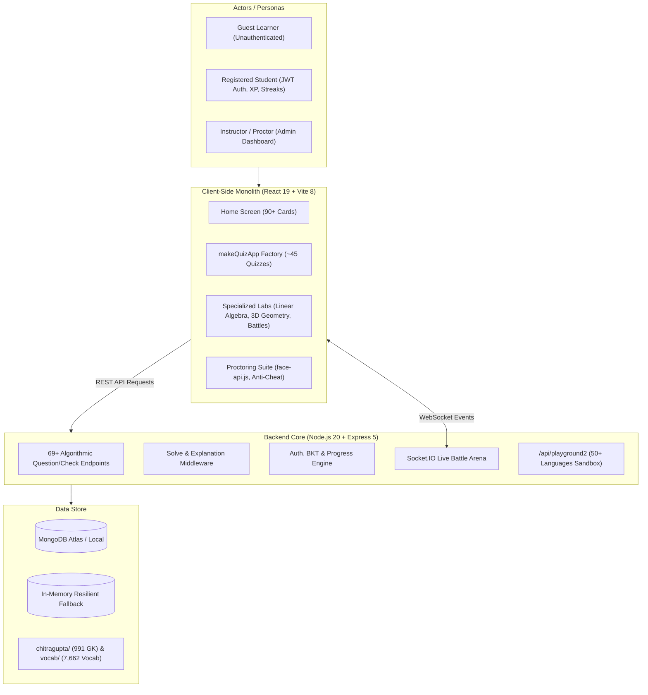

# Tenali Contributor Onboarding Document

**Contributor:** Lalitha Sri Harshitha  
**Repository:** [github.com/LalithaSriHarshitha/tenali](https://github.com/LalithaSriHarshitha/tenali)  
**Date:** September 2026  

---

## 1. What is Tenali?

**Tenali** (named after the witty scholar Tenali Raman) is an open-source, adaptive mathematical learning platform designed to make mathematics intuitive, engaging, and accessible to all learners—from early childhood arithmetic to high school and GCSE/IGCSE-level calculus and linear algebra.

### Core Problems Addressed:
1. **Math Anxiety & Passive Learning:** Traditional math platforms rely heavily on passive lecture videos or static textbook question banks. Tenali replaces this with **instant, interactive, concrete manipulatives** and active problem-solving.
2. **Predictable, Exhaustible Question Banks:** Static databases enable memorization rather than deep conceptual mastery. Tenali generates every single question **algorithmically on the fly**, providing an infinite stream of unique problems.
3. **Rigid Pacing & Abrupt Difficulty Spikes:** Learners often struggle when platforms jump abruptly between difficulty tiers without scaffolding. Tenali uses real-time adaptive scoring and knowledge tracing to adjust the challenge dynamically.
4. **Digital Divide & Cost Barriers:** Many adaptive learning tools require paid subscriptions or heavy bandwidth. Tenali is built to be **zero-cost, lightweight, and client-side friendly**, capable of running smoothly even in low-bandwidth environments.

---

## 2. What Do You Understand by Tenali as a System?

Tenali operates as an integrated ecosystem comprising multiple user personas, core mathematical and linguistic entities, modular backend engines, and reactive frontend workflows.



### Key System Entities & Modules:
- **Learners & Personas:**
  - *Guest:* Immediate access to all 69+ topics without signup friction; progress is held in client `localStorage`.
  - *Registered User:* Authenticated via JWT; scores, XP, mastery records, and daily check-ins persist in MongoDB.
  - *Proctor/Admin:* Monitors test sessions, facial emotion metrics, focus lost/blur events, and anti-cheat telemetry.
- **Question & Validation Engine:**
  - Every topic exposes a symmetric pair: `GET /<type>-api/question?difficulty=0..3` and `POST /<type>-api/check`.
  - The **Solve Middleware** intercepts check requests containing `{ solve: true }` and returns step-by-step reasoning generated dynamically by `generateExplanation()`.
- **Multiplayer Battle Arena:**
  - Uses Socket.IO rooms for synchronized real-time 1-v-1 math duels with fastest-finger scoring and streak multipliers.
- **Cognitive & Pedagogical Tracing:**
  - Uses **Bayesian Knowledge Tracing (BKT)** to calculate skill acquisition probabilities and **Spacing Ladders** to schedule review.

---

## 3. Current State of the Repository: What Has Been Done So Far?

After exploring the codebase, the following systems and capabilities are currently implemented:

### A. Technology Stack
- **Frontend:** React 19, Vite 8, Framer Motion, Three.js (`@react-three/fiber`, `@react-three/drei`), Mafs, Chart.js, `face-api.js`.
- **Backend:** Node.js (v20+), Express 5, Mongoose 9, Socket.IO 4, `bcryptjs`, `jsonwebtoken`, `express-rate-limit`.
- **Question Banks:** 991 General Knowledge questions in `chitragupta/questions/` and 7,662 Vocabulary entries in `vocab/questions/`.

### B. Architecture & Directory Breakdown
- **`server/index.js` (~14,300 lines):** Express server housing 69+ topic generators, solve middleware, static client serving, and Socket.IO battle handlers.
- **`server/auth.js` & `server/progress.js`:** JWT-based authentication, bcrypt hashing (10 rounds), rate limiting, and MongoDB persistence with complete in-memory fallback.
- **`server/compiler.js`:** Multi-language remote code execution runner supporting 50+ programming languages via `/api/playground2/run`.
- **`client/src/App.jsx` (~69,800 lines):** Monolithic frontend containing shared hooks (`useTimer`, `useAutoAdvance`), the `makeQuizApp` factory, custom quiz applications, and the home navigation grid.
- **Specialized Lab Apps:**
  - `LinearAlgebraApp.jsx`: 56 missions across 6 modules with 3D coordinate visualizations.
  - `BattleApp.jsx`: Real-time multiplayer Socket.IO duel interface.
  - `detective-app.jsx`: Math Detective Agency story-driven clues.
  - `VisualMathLabRedux.jsx`: Concrete manipulatives (frog jumps, candy sharing, plant arrays).
  - `CarJourneyApp.jsx`, `LcmHcfApp.jsx`, `TreasureHuntApp.jsx`, `CrosswordApp.jsx`.
- **Proctoring Suite (`client/src/proctor/`):** Full anti-cheat monitoring including camera feed, `face-api.js` emotion recognition, tab-switch tracking, and PiP mode.
- **Deployment & Ops:** Production systemd service (`tenali.service`), Nginx reverse proxy with SSL (`server/deploy/tenali-nginx.conf`), and Render deployment config (`render.yaml`).

---

## 4. Gaps Observed in the Code

During our in-depth codebase exploration, the following technical debts, bugs, security vulnerabilities, and architectural gaps were identified:

---

### 🚨 Gap 1: Frontend Monolithic Architecture & Lack of Deep-Link Routing
- **Where:** [`client/src/App.jsx`](file:///d:/tenali/client/src/App.jsx#L1-L69825)
- **What:** The entire application (over 69,000 lines of code) is contained in a single source file. Routing is managed purely through an internal React state variable (`const [mode, setMode] = useState('home')`) rather than standard path routing or lazy-loaded components.
- **Why It Matters:**
  1. *Developer Velocity & Merge Conflicts:* Any open-source PR touches `App.jsx`, causing frequent git merge conflicts.
  2. *Performance & Bundle Size:* Every visitor downloads all 69 quiz apps, 3D libraries, and story datasets upfront on initial page load, impacting low-bandwidth learners.
  3. *User Experience:* The browser's native Back/Forward buttons do not work, and users cannot share direct links to specific puzzle topics.

---

### 🚨 Gap 2: Disconnection Between Client `adaptScore` and Server BKT Persistence
- **Where:** [`client/src/App.jsx`](file:///d:/tenali/client/src/App.jsx#L58-L65) vs. [`server/lib/bkt.js`](file:///d:/tenali/server/lib/bkt.js#L19-L40) and [`server/progress.js`](file:///d:/tenali/server/progress.js#L22-L47)
- **What:** In `makeQuizApp`, adaptive difficulty is managed via a local React state variable `adaptScore` ($0.0 \le s \le 3.0$) that resets to default on every session reload. Meanwhile, the server's Bayesian Knowledge Tracing (BKT) engine in `server/lib/bkt.js` computes long-term mastery $P(L)$, but this value is not used to initialize the difficulty band when a returning user reopens a quiz.
- **Why It Matters:** Returning learners are forced to re-prove their skill level on every visit by starting from the basic difficulty tier. This breaks learning continuity (Problem Statement B) and causes frustration for proficient students.

---

### 🚨 Gap 3: Unbounded Memory Leak in Socket.IO Multiplayer Rooms
- **Where:** [`server/index.js`](file:///d:/tenali/server/index.js#L14128-L14240)
- **What:** Multiplayer battle rooms are stored in a simple Node.js memory map:
  ```javascript
  const rooms = new Map();
  ```
  When players abandon a match or disconnect unexpectedly, rooms remain in memory indefinitely without TTL expiration or automated cleanup sweeps.
- **Why It Matters:** Under heavy traffic or malicious connection spam, memory consumption grows unbounded, eventually triggering Node process crashes (`Out of Memory`) and dropping active user sessions.

---

### 🚨 Gap 4: Ephemeral In-Memory State Loss on Server Restart
- **Where:** [`server/progress.js`](file:///d:/tenali/server/progress.js#L6-L47) & [`server/auth.js`](file:///d:/tenali/server/auth.js#L140-L175)
- **What:** When running in local development or when MongoDB is unreachable, progress updates are stored in `inMemoryProgress = {}`. These structures are purely volatile and are not serialized to local fallback disk files.
- **Why It Matters:** During server redeploys or restarts, test users and offline students lose all recorded XP, earned badges, and mastery progress, rendering long-term habit testing impossible without external database setup.

---

### 🚨 Gap 5: Inconsistent UI Styling & Light Theme Contrast Failures
- **Where:** [`client/src/App.jsx`](file:///d:/tenali/client/src/App.jsx), [`client/src/CarJourneyApp.css`](file:///d:/tenali/client/src/CarJourneyApp.css#L20-L80), [`client/src/LcmHcfApp.css`](file:///d:/tenali/client/src/LcmHcfApp.css)
- **What:** Numerous components use hardcoded hex colors (`#4CAF50`, `#FF5722`, `#ffffff`, `#2c2622`) instead of centralized CSS custom properties (`var(--clr-accent)`, `var(--clr-card)`, `var(--clr-text)`).
- **Why It Matters:** When the user toggles the Light Theme (`[data-theme="light"]`), hardcoded white or light-brown text creates illegible, low-contrast UI states, violating accessibility standards and increasing extraneous cognitive load.

---

## 5. Ideas for the Project

Based on the gaps observed above, here are four concrete, grounded engineering proposals:

---

### 💡 Idea 1: Flexible Weekly Mastery Target & Smart Spaced Review (Selected for RFC)
- **Proposal:** Replace punishing daily streaks with a flexible 3-day/week mastery target, paired with a 1-click **2-Minute Daily Warmup** that queries 3 decay-prioritized questions via BKT.
- **Why It Helps:** Directly solves learner churn (Problem Statement A) by preventing the "abstinence violation effect" when a user misses a day, while offering a low-friction entry point that reinforces fading memories.
- **Implementation Approach:** Add `/api/review/daily-warmup` integrating `server/lib/bkt.js` and `server/lib/spacingLadder.js`, and render a minimalist `<DailyWarmupCard />` on the home grid conforming to `var(--clr-card)` and `var(--clr-accent)`.

---

### 💡 Idea 2: Unified BKT Difficulty Initialization & Session Continuity
- **Proposal:** Connect the client quiz factory (`makeQuizApp`) to the server's BKT progress database. When a learner starts a topic, initialize `adaptScore` based on their recorded mastery $P(L)$ rather than resetting to `1.0`.
- **Why It Helps:** Solves Problem Statement B (Adaptive Progression) by guaranteeing continuity across practice sessions and eliminating redundant drill repetition for advanced learners.
- **Implementation Approach:** Expose mastery level in `GET /api/progress/raw` and pre-populate the initial `difficulty` parameter in `makeQuizApp`.

---

### 💡 Idea 3: Socket.IO Room TTL Janitor & Disconnect Rejoin Window
- **Proposal:** Implement an automated TTL garbage-collector in `server/index.js` that prunes empty or stale rooms older than 10 minutes, accompanied by a 30-second reconnection grace period for dropped sockets.
- **Why It Helps:** Eliminates memory leaks in the Node.js backend and improves resilience for mobile students on spotty internet connections.
- **Implementation Approach:** Add a recurring `setInterval` cleaner in `server/index.js` checking `room.lastActivity` timestamps.

---

### 💡 Idea 4: Automated Design Token Linter & UI Component Migration
- **Proposal:** Gradually replace hardcoded CSS styles in mini-apps with reusable primitives from `client/src/components/ui/` (`<Button>`, `<Card>`, `<Modal>`) and enforce CSS variable compliance.
- **Why It Helps:** Eliminates contrast bugs in Light Theme, respects Cognitive Load Theory, and guarantees visual consistency across all contributor features.
- **Implementation Approach:** Create standard UI wrapper components and clean up legacy CSS files.

---

## 6. Your Contribution

During this onboarding period, the following verified contributions were completed:

1. **Comprehensive Codebase & Architectural Audit:** Explored the full repository structure, verified endpoint contracts, inspected BKT math logic, and documented the 5 critical gaps above.
2. **Pedagogical Precedent Research:** Analyzed learning mechanics from Duolingo (Half-Life Regression), Khan Academy (Mastery Trees), and Cognitive Load Theory (Sweller/Mayer) to establish research-backed solutions for Tenali.
3. **Authored Formal RFC 0001:** Drafted and committed [`docs/rfcs/engagement/0001-flexible-weekly-mastery-and-smart-spaced-review.md`](file:///d:/tenali/docs/rfcs/engagement/0001-flexible-weekly-mastery-and-smart-spaced-review.md), proposing a flexible weekly habit loop and smart spaced practice engine.
4. **Repository Tracking Configuration:** Configured `.gitignore` to enable tracking of architectural RFC documentation in `docs/rfcs/`.
5. **Submitted Onboarding Document:** Prepared this complete, six-section onboarding document in `Ideas/ONBOARDING-LalithaSriHarshitha.md` to establish alignment with Tenali maintainers.
