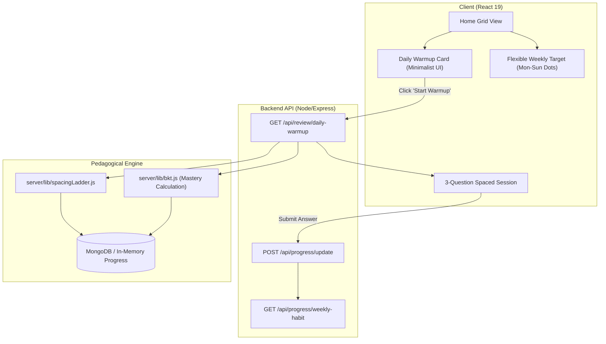

# RFC 0001: Flexible Weekly Mastery Target & Smart Spaced Review

- **Status:** Proposed
- **Author:** Intern / Contributor
- **Module:** `engagement`
- **Core Problem Statement:** Problem Statement A (Learner Motivation & Retention)
- **Target Date:** August 2026

---

## 1. Problem Statement

Tenali currently suffers from learner churn after initial engagement. While learners enjoy the interactive math quizzes during their first visit, returning rates drop sharply. 

### Key Pain Points Identified:
1. **Brittle Habit Loops:** Traditional daily streaks (1-day missed = reset to 0) punish minor life disruptions, triggering the *"abstinence violation effect"* where learners abandon the platform completely after breaking a streak.
2. **Lack of a Low-Barrier Entry Point:** When returning to the platform, learners face a wall of 90+ topic cards with no clear, low-friction starting task, causing decision paralysis (Hick's Law).
3. **Forgotten Concepts (Memory Decay):** Concepts practiced weeks ago decay without timely re-exposure, leading to unexpected failures when encountering advanced topics in Guided Journeys.

---

## 2. Feature Description

We propose **Flexible Weekly Mastery Targets** paired with a **Smart Spaced Review Warmup**:

1. **Flexible Weekly Target (3–5 Days / Week):** Instead of requiring unbroken daily logins, learners commit to a flexible weekly goal (e.g., practice 3 distinct days within a Monday–Sunday window). Meeting the goal increments their *Weekly Streak*.
2. **2-Minute Daily Warmup (Smart Spaced Review):** A prominent, single-click entry point on the home grid that curates **3 quick review questions** from topics the learner has previously attempted, prioritized by estimated memory decay and Bayesian Knowledge Tracing (BKT) mastery scores.
3. **Constructive Competence Feedback:** Completing the warmup marks the day as active toward the weekly target, awards a lightweight XP burst (+15 XP), and displays a compact visual confirmation without distracting banners or pop-up clutter.

---

## 3. High-Level Solution & Architecture



### 3.1. Backend Design

#### A. User & Progress Schema Extensions (`server/auth.js`, `server/progress.js`)
```javascript
// Add to User/Progress data model
{
  weeklyHabit: {
    targetDaysPerWeek: { type: Number, default: 3 }, // 3 days/week default
    currentWeekYear: { type: String },               // e.g. "2026-W35"
    activeDaysThisWeek: [String],                     // e.g. ["2026-08-28", "2026-08-30"]
    weeklyStreak: { type: Number, default: 0 },       // Number of consecutive weeks target met
    lastWarmupCompletedAt: { type: Date, default: null }
  }
}
```

#### B. Smart Warmup Question Selector (`/api/review/daily-warmup`)
1. Fetches the student's attempted topics from their progress record.
2. Applies the decay function:
   $$\text{Decay Priority} = (1 - P(L_{\text{topic}})) \times \ln(1 + \Delta t_{\text{days}})$$
   where $P(L)$ is the BKT mastery probability and $\Delta t$ is the days elapsed since last practice.
3. Selects the top 3 topics with highest decay priority and generates 1 question per topic at the student's current difficulty band (`easy`/`medium`/`hard`).
4. *Fallback for new guests:* Selects 3 foundational arithmetic/algebra questions (`addition`, `multiply`, `basicarith`).

---

### 3.2. Frontend Design & UI System Adherence

The UI strictly complies with the **Tenali Minimalistic Design System**:

#### A. Weekly Habit & Warmup Card
- Sits above the 90+ topic grid on the Home screen.
- Displays:
  - Screen title using `var(--font-display)`.
  - 7 subtle weekly status dots (active = `var(--clr-correct)`, inactive = `var(--clr-border)`).
  - Single primary call-to-action button using `var(--clr-accent)`: **"Start 2-Min Warmup (3 Qs)"**.
  - Background container styled with `var(--clr-card)`, `var(--radius)`, and `var(--shadow-card)`.

#### B. Spaced Warmup Modal / Mini-Runner
- Runs 3 questions with instant feedback.
- Progress bar: `1/3 → 2/3 → 3/3`.
- No extra buttons or ads; only standard input field with `var(--clr-input)` and focus state.
- Completion screen: Confetti burst, "+15 XP", and a single "Done" button returning to Home.

---

## 4. Alternatives Considered

| Approach Considered | Trade-Offs | Why It Was Rejected |
| :--- | :--- | :--- |
| **Strict 7-Day Calendar Streak** | High initial urgency | High churn rate when a single day is missed; promotes anxiety rather than genuine competence. |
| **Streak Freezes / Buybacks** | Forgives occasional misses | Requires virtual currency paywalls/sinks, violating Tenali's zero-cost open educational philosophy. |
| **Full 10-Question Diagnostic Quiz** | Thorough assessment | High cognitive burden upon opening the app; discourages quick daily touchpoints. |
| **Browser Push Notifications** | Out-of-app reminders | Intrusive, low conversion, and creates extraneous distraction. |

---

## 5. Research & Theoretical Grounding

1. **Self-Determination Theory (Deci & Ryan, 2000):**
   - *Autonomy:* The learner chooses which 3 days of the week to practice.
   - *Competence:* The 2-minute warmup reinforces previously learned concepts, providing a rapid feeling of mastery and accomplishment.
2. **Habit Formation & Resilient Goal Structuring (Clear, 2018; Eyal, 2014):**
   - Flexible targets ("never miss twice") maintain long-term habit identity better than rigid rules that collapse upon the first failure.
3. **Half-Life Regression & Spaced Retention (Settles & Meeder, 2016; Ebbinghaus, 1885):**
   - Activating neural pathways at the point of optimal memory decay produces durable long-term retention with minimal practice volume.
4. **Cognitive Load & Signaling Principles (Sweller, 1988; Mayer, 2021):**
   - Eliminating decision fatigue on the home screen by providing one clear, primary recommended action per day.

---

## 6. Implementation Milestones

- [ ] **Milestone 1 (Backend):** Implement `/api/review/daily-warmup` endpoint and weekly habit tracking logic with in-memory & Mongo fallback.
- [ ] **Milestone 2 (BKT Integration):** Connect question decay weighting with `server/lib/spacingLadder.js` and `server/lib/bkt.js`.
- [ ] **Milestone 3 (Frontend Component):** Build `<DailyWarmupCard />` and `<WeeklyRhythm />` using CSS tokens (`App.css`).
- [ ] **Milestone 4 (Interactive Runner):** Build the 3-question warmup modal flow and verify seamless return to home.
- [ ] **Milestone 5 (QA & Themes):** Test dark and light theme contrast, mobile responsiveness, and run `npm run lint` & `npm run build`.

---

## 7. Open Questions & Reviewer Feedback

- *Question 1:* Should guest (unauthenticated) learners have their weekly target saved in `localStorage['tenali-weekly-habit']`? (Proposed: Yes, with automatic migration upon login).
- *Question 2:* Is 3 questions the optimal warmup length, or should users be allowed to configure it between 3 and 5?
